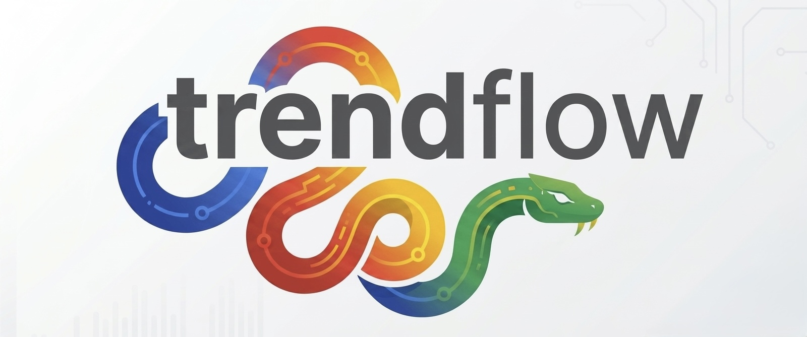

<p align="center">
  
</p>

# Trendflow

[](https://pypi.org/project/trendflow/)

A type-safe Python library for querying, streaming, and exporting Google Trends data

- GitHub: [https://github.com/dariomory/trendflow/](https://github.com/dariomory/trendflow/)
- PyPI package: [https://pypi.org/project/trendflow/](https://pypi.org/project/trendflow/)
- Created by: **[Dario Mory](https://mory.dev)** | GitHub [https://github.com/dariomory](https://github.com/dariomory) | PyPI [https://pypi.org/user/dariomory/](https://pypi.org/user/dariomory/)
- Free software: MIT License

## Features

- **Type-safe API:** regions, timeframes, resolutions, and export formats use enums instead of raw strings.
- **Rich queries**: interest over time, regional breakdown, live trending searches, and related queries, with dataclass results.
- **Exports**: JSON, CSV, or load results into a pandas `DataFrame`.

## Usage

```python
import trendflow
from trendflow import Region, Timeframe, Resolution, ExportFormat

# Initialize client (optional API config)
tf = trendflow.Client(language="en", timeout=10)

# --- Enums for type safety ---
# Region.US, Region.GB, Region.DE ...
# Timeframe.PAST_DAY, Timeframe.PAST_WEEK, Timeframe.PAST_YEAR, Timeframe.PAST_5_YEARS
# Resolution.COUNTRY, Resolution.REGION, Resolution.CITY

# Fetch interest over time
data = tf.interest_over_time(
    keywords=["Python", "JavaScript", "Rust"],
    timeframe=Timeframe.PAST_YEAR,
    region=Region.US
)

# Dataclass-backed results
print(data.keywords)        # ["Python", "JavaScript", "Rust"]
print(data.granularity)     # "weekly"
print(data.points)          # list of TrendPoint(date, scores: dict)

# Get regional breakdown
regional = tf.interest_by_region(
    keyword="Python",
    resolution=Resolution.COUNTRY
)

# Trending searches right now
trending = tf.trending_now(region=Region.US)
for item in trending.results:
    print(item.title, item.traffic, item.articles)  # TrendingItem dataclass

# Related queries — returns RelatedResult dataclass
related = tf.related_queries("machine learning")
for query in related.top:
    print(query.term, query.value)    # RelatedQuery(term, value)
for query in related.rising:
    print(query.term, query.breakout) # RelatedQuery(term, breakout%)

# --- Exports ---
data.export(ExportFormat.CSV,  path="trends.csv")
data.export(ExportFormat.JSON, path="trends.json")
data.to_dataframe()  # pandas DataFrame
```

## Documentation

Documentation is built with [Zensical](https://zensical.org/) and deployed to GitHub Pages.

- **Live site:** [https://dariomory.github.io/trendflow/](https://dariomory.github.io/trendflow/)
- **Preview locally:** `just docs-serve` (serves at [http://localhost:8000](http://localhost:8000))
- **Build:** `just docs-build`

API documentation is auto-generated from docstrings using [mkdocstrings](https://mkdocstrings.github.io/).

Docs deploy automatically on push to `main` via GitHub Actions.

## Development

To set up for local development:

```bash
# Clone your fork
git clone git@github.com:dariomory/trendflow.git
cd trendflow

# Install in editable mode with live updates
uv tool install --editable .
```

This installs the CLI globally but with live updates - any changes you make to the source code are immediately available when you run `trendflow`.

Run tests:

```bash
uv run pytest
```

Run quality checks (format, lint, type check, test):

```bash
just qa
```

## Author

Trendflow was created in 2026 by Dario Mory